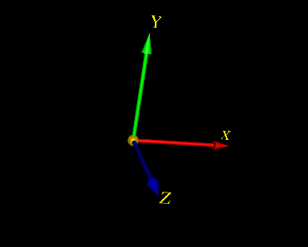

AltIMU-10
=========

Embedded library for working with AltIMU-10 (gyro, accelerometer, magnetometer, barometer, termometer)

A simple code for Raspberry PI that reads angular velocity measurements from AltIMU-10 sensor, 
integrates quaternion kinematic equation. As a result there is a relative orientation of coordinate 
system frame attached to sensor. The value of relative orientation is sent to Matlab Simulink model by 
UDP protocol. The simulink model represents this orientation visually.

Building
-
Write correct IP address in file *main.cpp* in src folder and type
```
  make clean
  make
```

Running
-
Open and run simulink model ./simulink/frame_renderer.slx, and after this run gyro program on RaspberryPI
```
  ./run.sh
```
or 
```
  sudo nice --20 ./gyro
```


